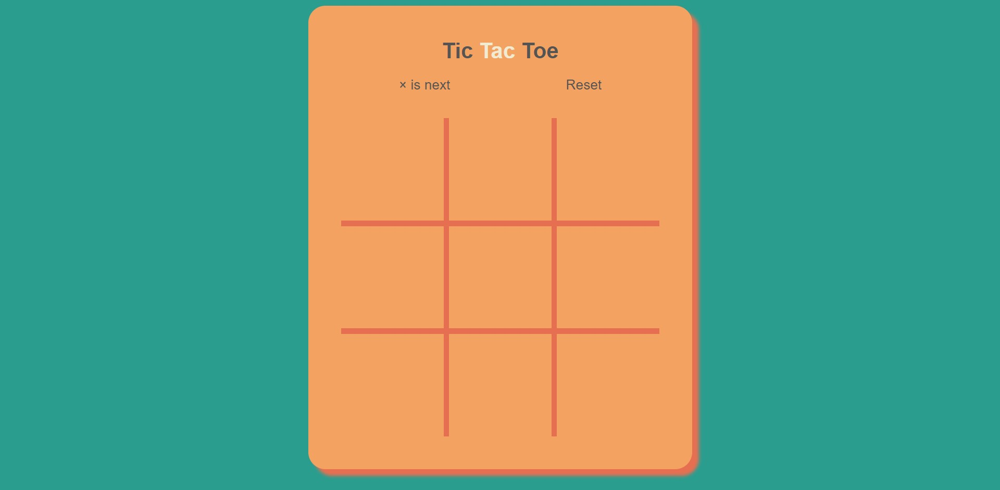
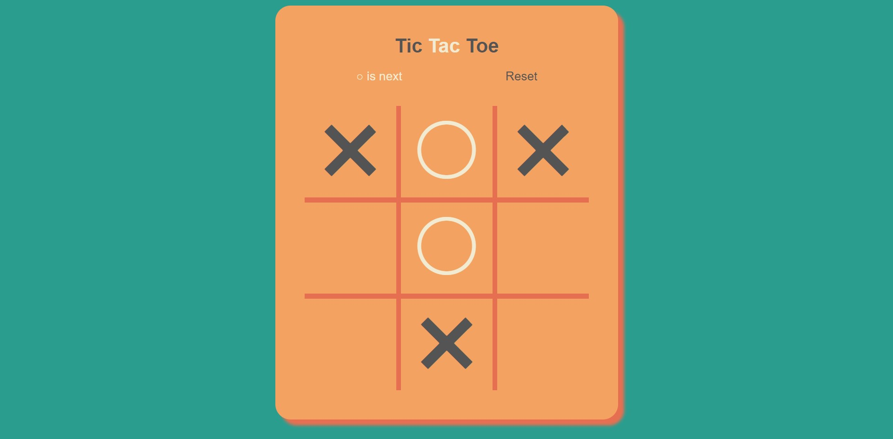
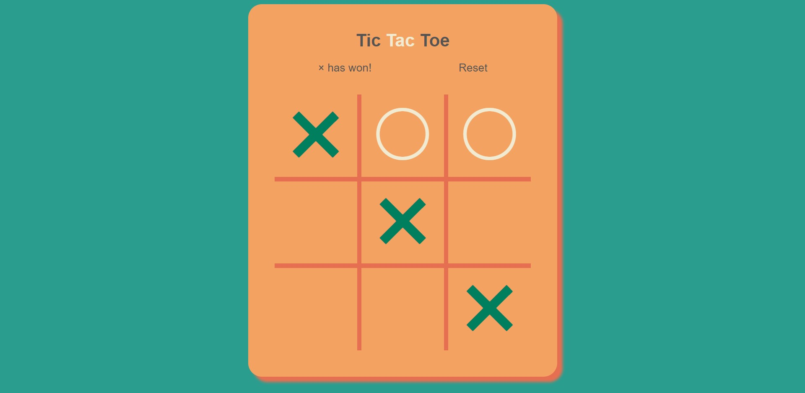

# TicTacToe

This project is a working clone of the classic TicTacToe game.
Built using JavaScript, HTML and CSS, this project uses JS DOM manipulation to check the status of the game and each individual cell in the TicTacToe grid.

---

---

